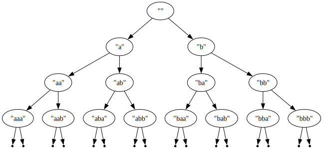

1. Дефинирайте константата nats, която е списък от всички естествени числа

2. Използвайки константата nats и функцията filter, дефинирайте константата primes, която е списък от всички прости числа

3. Дефинирайте константата primes2, която е списък от всички прости числа, и е имплементирана чрез безкрайно сито на Ератостен (както правихме на scheme)

4. Дефинирайте функцията iterate f x, която по дадена функция f връща безкрайния списък x, f x, f (f x), ...

5. Дефинирайте константата rats :: [(Integer, Integer)], която е списък от всички рационални числа, представени като двойки от числител и знаменател (такъв че всяко     рационално число има свой индекс в този списък)

6. Дефинирайте константата fibs, която е списък от всички числа на Фибоначи. Възползвайте се от мемоизацията, идваща от използването на безкраен списък, за да подсигурите, че намирането на N-тото число на Фибоначи има сложност O(N), а не O(N²). Hint: може би библиотечната функция zipWith ще ви е от помощ

*  Задачи за лениви алгебрични типове:
7. Дефинирайте тип BinTree a, представящ (може би безкрайно) двоично дърво, съдържащо елементи от тип a във върховете си

*  Ако искате, може да дефинирате подходяща инстанция instance (Show a) => Show (BinTree a), която показва дървото на екрана по красив начин
8. Напишете функция trimBinTree :: Integer -> (BinTree a) -> (BinTree a), която отрязва дърво до дадена дълбочина

9. Дефинирайте константата babaTree :: BinTree String, представяща такова безкрайно дърво: безкрайно двоично дърво:
  

    

  
